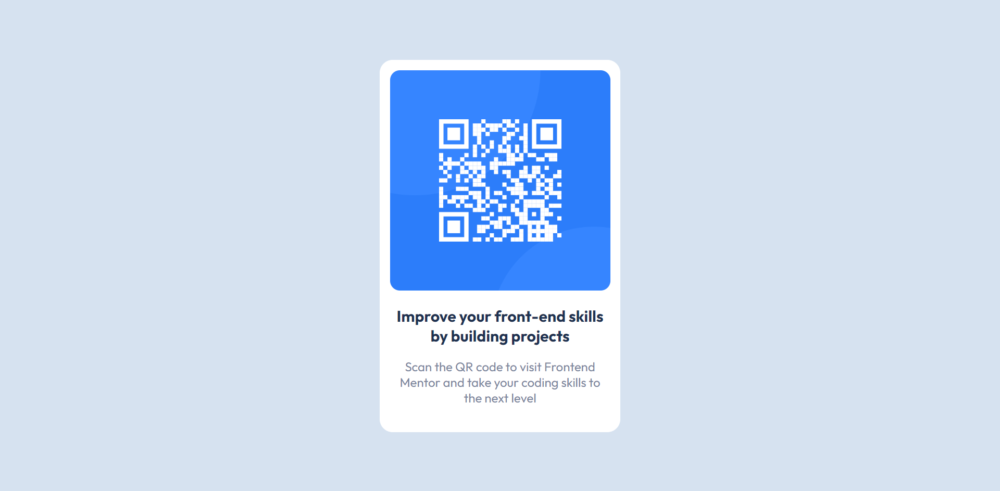

# Frontend Mentor - QR code component solution

This is a solution to the [QR code component challenge on Frontend Mentor](https://www.frontendmentor.io/challenges/qr-code-component-iux_sIO_H). 

## Table of contents

- [Overview](#overview)
  - [Screenshot](#screenshot)
  - [Links](#links)
- [My process](#my-process)
  - [Built with](#built-with)
  - [What I learned](#what-i-learned)
  - [Resources I Used](#resources-i-used)


## Overview
This challenge was my introduction to [Frontend Mentor](https://www.frontendmentor.io) and my first time working with a design file. It was a great starter project to get me into the work cycle of not only using a design file, but commiting to [Github](www.github.com) more regularly.

The project it self wasn't anything too difficult, but still required me to look up things I had forgotten, as well as some things I hadn't quite learned yet. 

### Screenshot

 

### Links

- Solution URL: [Add solution URL here](https://your-solution-url.com)
- Live Site URL: [Add live site URL here](https://your-live-site-url.com)

## My process

### Built with

- HTML
  - Semantic Tags
  - Accesability
- CSS
  - Flexbox
  - Mobile-first workflow
  - Variables

### What I learned
This project helped continue to cement my knowledge of HTML and CSS. Some useful things this project taught me include :
- How to work from a design file

    [See Design folder for reference]
- Importing fonts instead of downloading font files
```css
  /* Font import */
@import url('https://fonts.googleapis.com/css2?family=Outfit:wght@400;700&display=swap');

```
- The use of CSS variables
```css
/* Variables */

:root {
    --whiteMain: hsl(0, 0%, 100%);
    --lightGray: hsl(212, 45%, 89%);
    --grayBlue: hsl(220, 15%, 55%);
    --darkBlue: hsl(218, 44%, 22%);
}
```


### Resources I Used

- [CSS Ligt Reset](https://www.digitalocean.com/community/tutorials/css-minimal-css-reset) - This relatively small reset was useful to quickly create a baseline with more control of my CSS styles
- [Frontend Mentor](https://www.frontendmentor.io/) - The starter files that were given for the project helped the production as I didn't have to hunt down the font used, or what colors were used.
- [CSS Tricks](https://css-tricks.com/) - Anytime I forgot how to do something in CSS, I'd go to this website to quickly find what I was trying to do.

